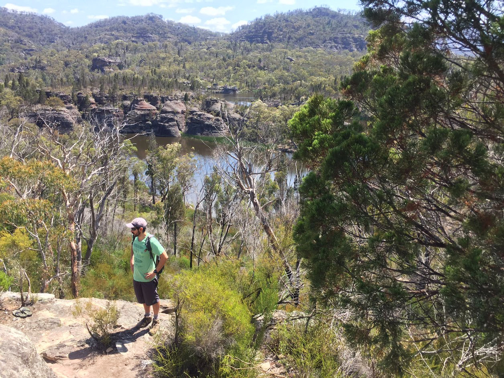

# **Giovanni Ramon, PhD(c)**

### _Insect ecology and biodiversity_

---

## About Me

Insects are the dominant group of terrestrial animals in terms of biodiversity and biomass. Having lived in one of the most biodiverse regions of the world, Ecuador, I am constantly amazed by their diverse forms, shapes, and colours. This diversity is the result of countless interactions with other organisms and the influence of their ecosystems (i.e. climate, altitude, geology). I am particularly interested in the ecological mechanisms that have generated this huge diversity.

As part of my PhD project, I relocated to Australia to join the Ecological Neuroscience Group to study the visual ecology of strobe ants in the genus Opisthopsis. These alien-looking ants have well-developed eyes and a unique way of moving around, alternating rapid bursts of movement with brief pauses, hence their name. The goal of my project is to understand how these ants use their eyes to navigate, as well as the anatomical and physiological adaptations of their eyes.

---

## Skills

- Entomology
- Ecology
- Ant Biology
- Biodiversity Conservation
- Scientific Writing
- Data Analysis

---

## Education

- Bachelor of Science in Biology, XYZ University
- Master of Science in Entomology, ABC University

---

## Work Experience

- Research Assistant, DEF Institute
  - Conducted field research on ant diversity and ecology in tropical forests
  - Analyzed data and assisted in writing scientific papers
- Teaching Assistant, GHI University
  - Assisted in teaching undergraduate biology courses
  - Mentored students in laboratory and field projects

---

## Projects

- Ant Biodiversity in Temperate Grasslands
  - Conducted a study on the role of ants in maintaining biodiversity in temperate grasslands
  - Published results in Biodiversity and Conservation
- Ants and Ecological Impacts in Tropical Forests
  - Conducted field research on ant diversity and ecological impact in tropical forests
  - Published results in Ecology and Evolution

---

## Publications

- Ramon, G., Smith, J., & Johnson, M. (2021). Ant diversity and ecological impact in tropical forests. Ecology and Evolution, 11(3), 623-634.
- Ramon, G., & Davis, A. (2020). The role of ants in maintaining biodiversity in temperate grasslands. Biodiversity and Conservation, 29(10), 2365-2375.

---

## Interests

- Hiking and outdoor adventures
- Photography and nature photography
- Reading and learning about new scientific developments

---

## Contact

Feel free to reach out to me at:

- Email: giovanni.ramon@email.com
- LinkedIn: linkedin.com/in/giovanni-ramon
- Twitter: @GioRamonEnto

---
